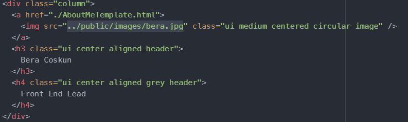
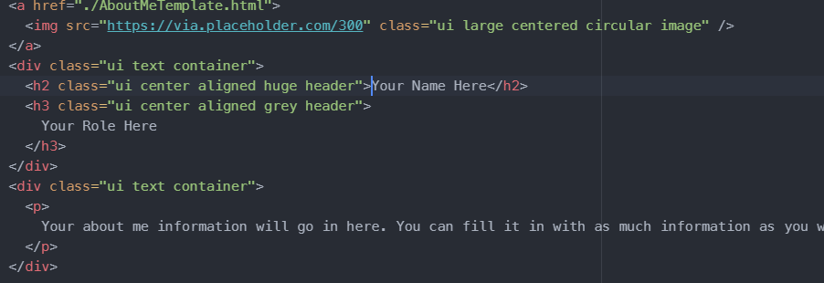
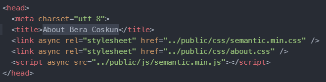

# Instructions to Add Yourself to the "Our Team" Page

1. Add your image to the public/images folder. The image should be square. 

2. Open the views/about.html file in a text editor.

3. Where your name is, add your image location as the source:

   

3. Open the views folder and duplicate the about-me-template.html file. Rename the duplicate to about-[your name].html

4. Open the duplicated file and edit it to describe you. You can ignore the side panel for now. Since everything is static, I'll have to manually update it once everyone is done:

   

5. Don't forget to modify the title in the header:

   